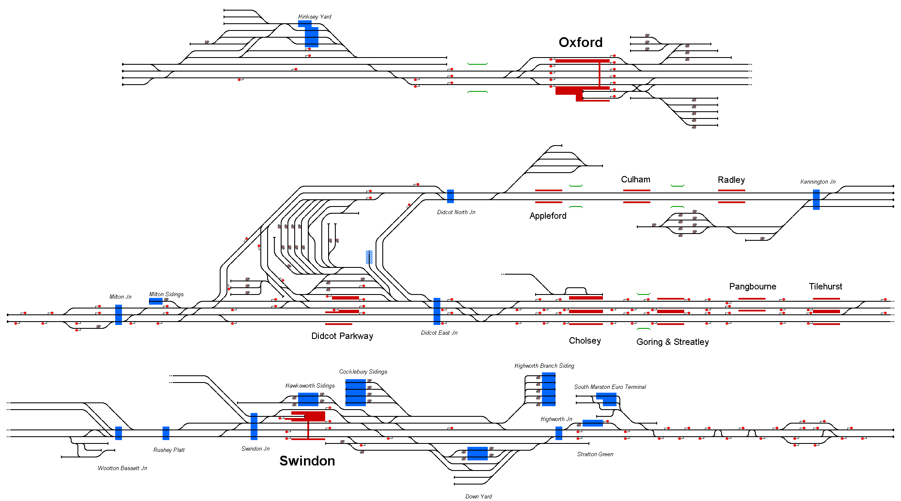

# Upper Thames Valley
This simulation covers the rail network between Tilehurst to the west of Reading, Swindon and Oxford within the UK.

## Current Status

| Stage         | Status        |
| ------------- |:-------------:|
| Track Plan     | :x: |
| Signalling      | :x:      |
| Naming | :x:      |
| Speed Limits | :x: |
| Distances | :x: |
| Timetable | :x: |
| Documentation | :x: |

## Data Sources

- [Traksy](https://traksy.uk/live/M+31+OXFD)
- [Class 60 Cab ride, Theale to Moreton cutting, Didcot, 2011 by RayEvans319 - Youtube](https://www.youtube.com/watch?v=rfEn_-Wrx0E)
